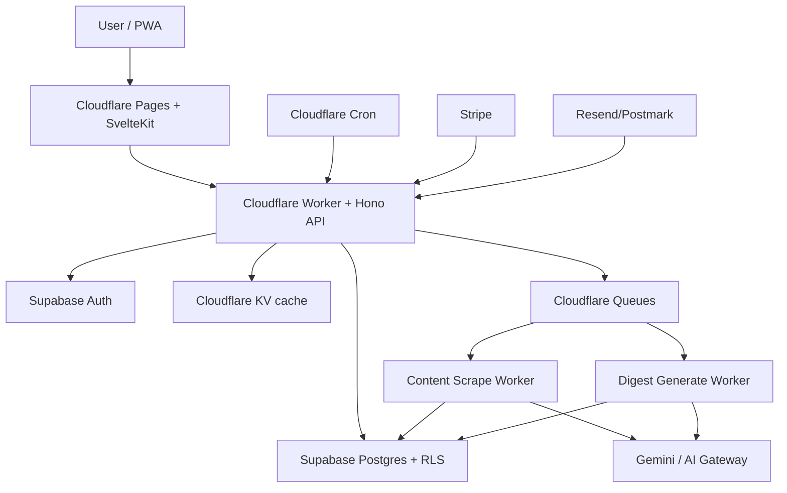

# Báo Cáo Kiến Trúc Readout Cho Web App Nhiều Người Dùng

Ngày: 2026-06-08

## Tóm Tắt Điều Hành

Kiến trúc hiện tại của Readout rất hợp lý cho mô hình self-hosted hoặc single-admin: Cloudflare Worker + Hono API, Cron, Queue, D1, KV, Gemini và SvelteKit PWA. Các lựa chọn này đang phục vụ tốt phần lõi của hệ thống: lấy nguồn tin, chống trùng bài, cào nội dung, tóm tắt bằng AI, retry và tạo digest.

Nhưng nếu mục tiêu là biến Readout thành một web app cho nhiều người dùng, kiến trúc hiện tại chưa tối ưu. Điểm nghẽn chính không nằm ở frontend, cũng không nằm ở SvelteKit. Điểm nghẽn nằm ở **mô hình dữ liệu** và **ranh giới sản phẩm**:

- `sources`, `articles`, `digests` hiện đang là dữ liệu global/single-user.
- Auth hiện là `X-Admin-Key`, chưa phải danh tính người dùng.
- Mỗi ngày chỉ có một digest, chưa có digest cá nhân hóa theo từng user.
- Chưa có quota, billing, theo dõi chi phí AI, hay observability theo user.
- D1 rất tốt cho app gọn nhẹ, nhưng với multi-tenant SaaS cần cân nhắc kỹ về dung lượng, isolation, RLS, migration và độ phức tạp truy vấn.

Khuyến nghị:

1. **Tiếp tục đi theo hướng web/PWA.**
2. **Không rewrite frontend lúc này. Giữ SvelteKit + Cloudflare Pages.**
3. **Giữ Cloudflare Worker/Hono/Queues/KV/AI Gateway nếu có thể.**
4. **Khi bắt đầu làm multi-user nghiêm túc, chuyển data plane sang Postgres/Supabase.**
5. **Migration nên đi theo pha: D1 cho beta nhỏ trước, Postgres khi schema user/digest/auth đã rõ.**

Kiến trúc mục tiêu phù hợp nhất cho solo developer:

```text
Cloudflare Pages + SvelteKit PWA
        |
Cloudflare Worker + Hono API
        |
Cloudflare Queues / Cron / KV / AI Gateway
        |
Supabase Postgres + Supabase Auth + RLS
        |
Stripe sau, Resend sau, Sentry sớm
```

Nói ngắn gọn: **giữ edge/runtime hiện tại, đổi mô hình dữ liệu và auth trước; chỉ đổi database sang Postgres khi thật sự bước vào multi-user.**

## Cơ Sở Nghiên Cứu

Report này dựa trên:

- Codebase hiện tại: `worker/`, `fe/`, `schema.sql`, `wrangler.toml`, cron/queue/API routes.
- Deep Research run: `trun_517b0278dd4b49ba8d9a7b3b0c9a8453`.
- Tài liệu chính thức được kiểm tra ngày 2026-06-08:
  - [Cloudflare Workers limits](https://developers.cloudflare.com/workers/platform/limits/)
  - [Cloudflare Workers pricing](https://developers.cloudflare.com/workers/platform/pricing/)
  - [Cloudflare D1 limits](https://developers.cloudflare.com/d1/platform/limits/)
  - [Cloudflare Queues batching/retries](https://developers.cloudflare.com/queues/configuration/batching-retries/)
  - [Cloudflare Hyperdrive](https://developers.cloudflare.com/hyperdrive/)
  - [Supabase pricing](https://supabase.com/pricing)
  - [Supabase RLS guide](https://supabase-supabase.mintlify.app/security/row-level-security)
  - [Vercel Function limits](https://vercel.com/docs/functions/limitations/)
  - [Firebase pricing](https://firebase.google.com/pricing)
  - [Firestore quotas](https://firebase.google.com/docs/firestore/quotas)
  - [Gemini API pricing](https://ai.google.dev/gemini-api/docs/pricing)

## Ảnh Chụp Kiến Trúc Hiện Tại

Readout hiện có:

```text
SvelteKit FE/PWA
  -> Cloudflare Worker Hono API
  -> D1: sources/articles/digests/scraper_configs
  -> Cron: fetch nguồn, retry bài lỗi, cleanup
  -> Queue: cào nội dung + Gemini summarize
  -> KV: scraper config / trạng thái rate-limit nhẹ
  -> Gemini trực tiếp hoặc Cloudflare AI Gateway
  -> WXT extension cho Reddit intake
```

Luồng lõi:

```text
cron
  -> fetch các non-Reddit source đang bật
  -> insert article rows với UNIQUE(source_id, url)
  -> enqueue content scrape
  -> queue fetch nội dung với SSRF guard
  -> Gemini summary/hot_score/tags
  -> regenerate digest cho ngày tương ứng
```

Schema hiện tại về cơ bản là single-user:

- `sources`: danh sách nguồn tin global.
- `articles`: bài viết gắn với một source.
- `digests`: một digest cho mỗi ngày.
- `scraper_configs`: scraper profile học được theo domain/mode.

Đây là hình dạng tốt cho một personal digest engine, nhưng chưa phải hình dạng tốt cho SaaS nhiều người dùng.

## Kiến Trúc Hiện Tại Đã Tối Ưu Chưa?

Cho personal/self-hosted: **gần như có**.

Lý do:

- Cloudflare Workers + Queues hợp với luồng ingest theo đợt.
- D1 đơn giản, rẻ, và gần với Worker code.
- Hono giữ API surface nhỏ.
- Queue consumer đã gom được scrape/summarize/retry vào một đường xử lý chính.
- Frontend đã có dáng PWA với cache IndexedDB.
- Reddit extension là workaround thực tế cho chuyện Reddit chặn server-side/datacenter access.

Cho web app nhiều người dùng: **chưa**.

Lý do:

- Auth hiện là admin-key gate, không phải mô hình user/session.
- Dữ liệu sản phẩm chưa có `user_id`.
- `digests.digest_date` đang unique toàn hệ thống, nên không thể có digest history riêng theo user.
- `sources.url UNIQUE` là tốt cho dedup, nhưng user cần trạng thái subscription riêng, tách khỏi danh tính canonical của source.
- Chi phí AI chưa được gắn với user, plan, operation hoặc model.
- Queue messages chưa mang đủ context sản phẩm cho workflow cá nhân hóa.
- Chưa có billing/quota để chặn một user thêm hàng trăm nguồn tốn tiền.

Refactor quan trọng nhất không phải đổi framework. Refactor quan trọng nhất là tách hai nhóm dữ liệu:

```text
Dữ liệu ingest dùng chung:
  sources, articles, scraper profiles, canonical extracted content

Dữ liệu thuộc về từng người dùng:
  user_sources, user_preferences, digests, digest_items, trạng thái read/saved, quota usage
```

## Những Sự Thật Nền Tảng Cần Nhớ

Cloudflare Workers mạnh hơn mô hình cũ kiểu “chỉ có 30 giây”. Tài liệu hiện tại cho thấy Workers Paid có thể đạt tới 5 phút CPU cho HTTP requests nếu cấu hình phù hợp, trong khi Cron Trigger có CPU time 30 giây cho interval dưới 1 giờ và 15 phút cho interval từ 1 giờ trở lên. CPU time không tính thời gian chờ network, nhưng một cron fanout lớn vẫn rủi ro vì còn wall time, subrequests, retry behavior và khả năng quan sát vận hành.

D1 rất hấp dẫn, nhưng có boundary sản phẩm rõ. Cloudflare document giới hạn 10 GB cho mỗi D1 database và nói D1 được thiết kế để scale ngang qua nhiều database nhỏ, ví dụ per-user hoặc per-tenant. Một Worker cũng có giới hạn metadata/bindings, nên mô hình hàng nghìn D1 database cần được thiết kế cẩn thận. Điều này khiến D1 phù hợp cho app nhỏ hoặc sharded design, nhưng kém thoải mái hơn Postgres nếu cần joins linh hoạt, billing, auth policies và analytics.

Queues là điểm mạnh nên giữ. Cloudflare Queues hỗ trợ batching và DLQ behavior: message vượt quá max retries sẽ bị xóa hoặc được đưa vào DLQ nếu cấu hình. Readout đã đi theo hướng queue-first, và đó là một hướng đúng.

Supabase/Postgres cung cấp những primitive còn thiếu cho multi-user: relational modeling, RLS, auth integration, migrations, SQL analytics và một đường quen thuộc để làm bảng billing/quota. Supabase docs mô tả RLS là cơ chế lọc row ở tầng database và có pattern policy dựa trên `auth.uid()` cho dữ liệu thuộc về user.

Hyperdrive quan trọng nếu Workers nói chuyện với Postgres. Cloudflare Hyperdrive được thiết kế để kết nối Workers với Postgres/MySQL hiện có và tăng tốc truy cập global mà không bắt buộc thay driver database.

## So Sánh Các Lựa Chọn

| Lựa chọn | Kết luận | Lý do |
|---|---|---|
| Giữ Cloudflare + D1 hoàn toàn | Tốt cho beta, không lý tưởng dài hạn | Nhanh nhất và rẻ nhất, nhưng thiếu RLS; mô hình size/binding của D1 khiến SaaS data khó hơn |
| Chuyển sang Vercel + Supabase | DX tốt, nhưng rewrite không cần thiết | Supabase hấp dẫn, nhưng bỏ mất queue/cron path hiện có của Cloudflare sẽ tạo churn |
| Supabase + Fly/Render worker | Job scale tốt, DevOps nhiều hơn | Tốt nếu background jobs vượt Workers, nhưng quá nhiều platform cho giai đoạn đầu |
| Firebase/Firestore | Không khuyến nghị | Auth/mobile rất tốt, nhưng pricing/query model theo document không hợp với article/digest analytics |
| Hybrid Cloudflare + Supabase Postgres | Khuyến nghị | Giữ runtime/code hiện tại, thêm data/auth primitive đúng cho multi-tenant |

## Kiến Trúc Mục Tiêu Đề Xuất



Nên giữ:

- SvelteKit frontend.
- Cloudflare Pages deploy.
- Style API bằng Hono.
- Các module scrape/fetcher hiện có, sau khi cleanup.
- Queue-based content scraping.
- SSRF guard.
- AI Gateway như một lớp observability/caching tùy chọn.
- Browser extension cho Reddit, ít nhất cho đến khi có đường kỹ thuật/pháp lý tốt hơn.

Nên thay đổi:

- Thay admin-key auth bằng Supabase Auth hoặc Clerk.
- Chuyển core product DB sang Postgres.
- Thêm multi-tenant schema.
- Tách dữ liệu ingest dùng chung khỏi dữ liệu thuộc về user.
- Thêm AI usage tracking và quotas trước khi mở signup.
- Thêm observability trước billing.

## Mô Hình Dữ Liệu Mục Tiêu

Schema khái niệm đề xuất:

```sql
-- Supabase Auth sở hữu auth.users.

profiles (
  user_id uuid primary key references auth.users(id),
  display_name text,
  plan text not null default 'free',
  source_limit int not null default 20,
  digest_limit_per_day int not null default 1,
  stripe_customer_id text,
  created_at timestamptz not null default now()
);

sources (
  id uuid primary key default gen_random_uuid(),
  canonical_url text not null unique,
  name text not null,
  type text not null, -- rss/html/reddit/youtube/github-trending/etc.
  channel_id text,
  enabled boolean not null default true,
  is_public boolean not null default true,
  created_by uuid references auth.users(id),
  last_fetched_at timestamptz,
  fetch_interval_minutes int not null default 180,
  created_at timestamptz not null default now()
);

user_sources (
  user_id uuid not null references auth.users(id),
  source_id uuid not null references sources(id),
  enabled boolean not null default true,
  custom_name text,
  created_at timestamptz not null default now(),
  primary key (user_id, source_id)
);

articles (
  id uuid primary key default gen_random_uuid(),
  source_id uuid not null references sources(id),
  canonical_url text not null,
  title text not null,
  description text,
  content text,
  summary text,
  summary_language text default 'vi',
  hot_score int,
  tags text[],
  published_at timestamptz,
  fetched_at timestamptz not null default now(),
  unique (source_id, canonical_url)
);

digests (
  id uuid primary key default gen_random_uuid(),
  user_id uuid not null references auth.users(id),
  digest_date date not null,
  status text not null default 'pending',
  summary_text text,
  total_articles int not null default 0,
  created_at timestamptz not null default now(),
  updated_at timestamptz not null default now(),
  unique (user_id, digest_date)
);

digest_items (
  digest_id uuid not null references digests(id) on delete cascade,
  article_id uuid not null references articles(id),
  rank int not null,
  relevance_score real,
  reason text,
  primary key (digest_id, article_id)
);

ai_usage (
  id uuid primary key default gen_random_uuid(),
  user_id uuid references auth.users(id),
  operation text not null, -- article_summary / digest_generate / translate
  model text not null,
  input_tokens int,
  output_tokens int,
  estimated_cost_usd numeric(12, 6),
  created_at timestamptz not null default now()
);
```

Điểm quan trọng: `articles` nên là dữ liệu dùng chung. Nếu 100 users subscribe cùng một RSS feed, Readout chỉ nên fetch và summarize một URL một lần, rồi tái sử dụng kết quả đó trong digest của từng user. Đây là khác biệt giữa một app bền vững và một hóa đơn AI rất đau.

## Pipeline Multi-User

Pipeline mục tiêu:

```text
Cron: source discovery
  -> chọn các global sources đã đến giờ fetch
  -> fetch feed/listing
  -> insert global articles mới
  -> enqueue content-scrape(article_id)

Queue: content scrape
  -> bỏ qua nếu article đã có summary
  -> fetch/sanitize content với SSRF guard
  -> summarize một lần ở tầng global
  -> update article
  -> enqueue digest-refresh cho các user/date bị ảnh hưởng

Queue: digest refresh
  -> tìm user_sources của user
  -> chọn các summarized articles trong ngày
  -> rank/filter theo preferences của user
  -> generate personalized digest
  -> upsert digests(user_id, digest_date)
  -> ghi digest_items
  -> record ai_usage
```

Đừng regenerate digest của mọi user sau từng article mãi mãi. Nên bắt đầu đơn giản:

- Beta: regenerate on demand hoặc một lần/ngày/user.
- Sau đó: batch digest refresh theo ngày và nhóm user.
- Về sau: incremental digest assembly bằng `digest_items`.

## Kế Hoạch Migration

### Phase 0: Giữ Stack Hiện Tại, Làm Rõ Product Boundary

Chưa đổi tech stack.

- Thêm documentation cho ranh giới giữa dữ liệu ingest dùng chung và dữ liệu thuộc về user.
- Giữ D1.
- Chỉ thêm concept `users`/`profiles` nếu beta thật sự cần.
- Giữ admin-key cho dogfooding nội bộ.
- Chưa thêm billing.

Phase này trả lời câu hỏi: người dùng có thật sự muốn digest này không?

### Phase 1: Multi-User Beta Trên Code Hiện Tại

Nếu muốn beta nhiều user nhanh nhất:

- Thêm auth thật.
- Thêm `user_sources`.
- Đổi `digests` thành `unique(user_id, digest_date)`.
- Giữ `articles` global.
- Thêm `ai_usage` tối thiểu.
- Giới hạn signup thủ công.

D1 chấp nhận được ở phase này nếu số user nhỏ và chưa hứa hẹn SaaS reliability.

### Phase 2: Chuyển Product DB Sang Postgres

Khi product direction đã rõ:

- Tạo Supabase project.
- Port schema sang Postgres.
- Thêm RLS policies.
- Dùng Supabase Auth.
- Kết nối Worker với Supabase/Postgres, ưu tiên qua Hyperdrive hoặc pooler.
- Chạy staging với mirrored data.
- Cut over API reads trước, writes sau.

### Phase 3: Billing, Email, Observability

Chỉ thêm sau khi có tín hiệu retention:

- Stripe plans.
- Quotas theo số source, tần suất digest, AI operations.
- Resend/Postmark digest emails.
- Sentry và dashboard chi phí custom.
- Admin view cho queue jobs lỗi và AI spend.

## Roadmap 30/60/90 Ngày

### 30 Ngày Đầu

- Giữ web/PWA.
- Không rewrite cả app.
- Refactor schema ở mức khái niệm: global sources/articles, user-owned subscriptions/digests.
- Chốt auth: Supabase Auth nếu đi Postgres; Clerk nếu tạm ở D1.
- Thêm bảng `ai_usage` trước public beta.
- Mời thủ công 5-20 users.

### Ngày 31-60

- Implement per-user source subscriptions.
- Generate digest riêng theo user.
- Thêm preferences cơ bản: ngôn ngữ, chủ đề, giờ nhận digest.
- Thêm một kênh delivery: web trước, email sau.
- Thêm observability: error tracking và dashboard queue failure.

### Ngày 61-90

- Quyết định D1 còn đủ hay không.
- Nếu đủ: tiếp tục beta, giữ chi phí thấp.
- Nếu không: migrate sang Supabase Postgres.
- Chỉ thêm Stripe nếu users quay lại hằng tuần/hằng ngày.
- Siết robots.txt handling, rate limit theo domain và abuse prevention.

## Ghi Chú Bảo Mật Và Pháp Lý

Giữ SSRF guard hiện có. Nên mở rộng thêm:

- Block private/internal IP ranges sau DNS resolution.
- Giới hạn response size.
- Enforce rate limit theo domain.
- Cache robots.txt decisions.
- Dùng `User-Agent` rõ ràng kèm contact URL.
- Ưu tiên RSS và excerpt/content do publisher cung cấp.
- Tránh biến Readout thành sản phẩm republish/full-reader nếu chưa có chiến lược pháp lý mạnh hơn.

Sản phẩm nên tóm tắt và trỏ người đọc về nguồn gốc, không thay thế nguồn gốc.

## Khuyến Nghị Cuối

Kiến trúc an toàn nhất không phải là “rewrite everything”. Nó là:

```text
Ngắn hạn:
  current Cloudflare stack + minimal multi-user schema + manual beta

Mục tiêu:
  Cloudflare Pages/Workers/Queues/KV + Supabase Postgres/Auth/RLS

Sau đó:
  Stripe, email delivery, observability mạnh hơn, có thể thêm external long-running workers
```

Kiến trúc hiện tại là một nền tảng tốt cho personal engine. Kiến trúc SaaS tối ưu hơn là **hybrid edge + relational core**: giữ những phần Cloudflare đang làm tốt, và đưa identity/data isolation sang Postgres trước khi app trở thành multi-user thật sự.
