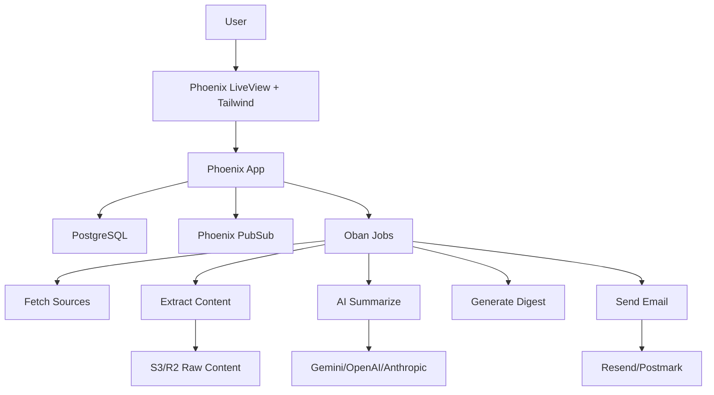

# Đề Xuất Kiến Trúc Mới Cho Readout

Ngày: 2026-06-09

## Kết Luận Ngắn

Nếu thiết kế lại Readout từ đầu với ưu tiên **hệ thống bền, ít tầng vận hành, backend mạnh cho job nền, frontend đủ tốt cho web/PWA**, đề xuất là:

```text
Phoenix + LiveView + Tailwind
PostgreSQL
Ecto
Oban
Broadway sau MVP nếu ingest lớn
S3/R2 cho raw content dài
Swoosh + Resend/Postmark cho email
Stripe sau khi có retention
```

Đây là kiến trúc **monolith có job engine mạnh**, phù hợp với một solo developer thích functional programming và muốn giữ hệ thống dễ hiểu trong thời gian dài.

## Mục Tiêu Thiết Kế

Readout không nên được thiết kế như một news site thông thường. Nó nên là một **personal intelligence briefing system**:

- người dùng chọn nguồn tin họ tin;
- hệ thống tự fetch/scrape/summarize;
- bài viết được dedupe toàn hệ thống;
- digest được cá nhân hóa theo từng user;
- backend phải xử lý job nền đáng tin cậy;
- frontend cần đọc tốt, nhanh, responsive, realtime vừa đủ.

Ưu tiên kỹ thuật:

1. Ít service nhất có thể.
2. Job nền bền, retry tốt, không mất trạng thái.
3. Data model rõ cho multi-user.
4. UI đủ polish nhưng không cần SPA phức tạp ngay.
5. Có đường mở rộng nếu ingestion/search/offline lớn lên.

## Kiến Trúc Đề Xuất

```text
Browser
  -> Phoenix LiveView UI
  -> Phoenix app
  -> PostgreSQL
  -> Oban jobs
  -> AI provider / Email provider / Object storage
```

Sơ đồ:



## Frontend

### Lựa Chọn

```text
Phoenix LiveView
HEEx function components
Tailwind CSS
Một ít JavaScript hooks khi thật sự cần
```

### Vì Sao Chọn LiveView

LiveView hợp với Readout vì phần lớn UI là:

- danh sách bài;
- digest view;
- source settings;
- filter;
- trạng thái job đang generate;
- dashboard quản trị;
- forms thêm/sửa/xóa source.

Các UI này không cần SPA phức tạp. LiveView cho phép render HTML từ server, giữ state ở server, và đẩy update realtime qua WebSocket khi digest/job thay đổi.

### Vì Sao Chọn Tailwind

Tailwind là lựa chọn styling tốt nhất trong phương án Phoenix LiveView vì:

- Phoenix hỗ trợ Tailwind mặc định từ Phoenix 1.7.
- Tailwind chỉ tạo CSS, không thêm JavaScript runtime.
- Dễ kiểm soát visual design hơn Bootstrap/daisyUI thuần.
- Dễ tái tạo UI hiện tại: dark mode, responsive layout, reading typography, drawer/sheet, filters, loading states.
- Tailwind v4 đã được tối ưu lại về build performance.

Quy tắc sử dụng:

- Không rải utility classes lặp lại khắp template.
- Tạo component nội bộ trong `core_components.ex`.
- Dùng Tailwind tokens cho màu, spacing, radius, typography.
- Dùng JS hooks chỉ cho những phần LiveView không nên tự gánh: gesture, pull-to-refresh, animation nhỏ, IndexedDB nếu cần.

### Giới Hạn

LiveView + Tailwind kém tự nhiên hơn SvelteKit nếu sản phẩm cần:

- offline-first sâu;
- IndexedDB cache phức tạp;
- mobile gesture rất giống native app;
- nhiều client-side state độc lập.

Với MVP web app, đây chưa phải blocker. Nếu sau này offline/mobile trở thành lợi thế cạnh tranh, có thể tách thêm SvelteKit PWA dùng Phoenix làm API backend.

## Backend

### Phoenix

Phoenix là app chính:

- auth/session;
- routing;
- LiveView pages;
- JSON API nếu cần;
- PubSub;
- webhook từ Stripe/email provider;
- admin dashboard.

Phoenix giữ hệ thống là một monolith rõ ràng thay vì tách sớm thành nhiều service nhỏ.

### PostgreSQL + Ecto

PostgreSQL là source of truth. Ecto dùng cho schema, query, changeset và migration.

Lý do:

- mô hình relational rất hợp với users/sources/articles/digests;
- unique constraints hỗ trợ idempotency;
- query tốt cho digest, filter, analytics;
- có full-text search sẵn;
- có thể thêm `pgvector` nếu cần semantic search.

### Oban

Oban là job engine chính, lưu job trong database.

Các queue đề xuất:

```text
source_fetch
article_extract
article_summarize
digest_generate
email_delivery
maintenance
```

Lý do chọn Oban:

- job bền qua restart;
- retry rõ ràng;
- unique jobs để tránh duplicate;
- scheduled jobs/cron jobs;
- không cần Redis cho MVP;
- enqueue job cùng transaction với DB write.

### Broadway

Broadway chưa cần ở MVP.

Chỉ thêm Broadway khi:

- số nguồn rất lớn;
- cần backpressure rõ;
- cần batch/partition theo domain;
- Oban workers bắt đầu không đủ cho ingestion throughput.

Vai trò của Broadway nếu thêm sau:

```text
source/article stream
  -> partition theo domain/source
  -> rate limit
  -> batch insert
  -> enqueue summarize jobs
```

## Data Model Mục Tiêu

Nguyên tắc quan trọng nhất:

```text
Article là global.
Digest là per-user.
```

Một article chỉ nên fetch/summarize một lần, dù có nhiều user cùng subscribe source đó.

Các nhóm bảng:

```text
users / profiles
sources
user_sources
articles
article_contents
article_summaries
digests
digest_items
read_articles
saved_articles
ai_usage
subscriptions
source_fetch_runs
scraper_profiles
```

Các constraint quan trọng:

```text
sources.canonical_url UNIQUE
articles(source_id, canonical_url) UNIQUE
user_sources(user_id, source_id) UNIQUE
digests(user_id, digest_date) UNIQUE
digest_items(digest_id, article_id) UNIQUE
```

`ai_usage` nên có từ sớm để biết chi phí theo:

- user;
- operation;
- model;
- input tokens;
- output tokens;
- estimated cost.

## Pipeline Xử Lý

### 1. Source Fetch

```text
Oban cron
  -> chọn sources đến giờ fetch
  -> fetch RSS/listing/API
  -> normalize URLs
  -> insert articles nếu chưa có
  -> enqueue article_extract
```

### 2. Article Extract

```text
article_extract job
  -> SSRF guard
  -> fetch content
  -> extract readable text
  -> lưu article_contents
  -> enqueue article_summarize
```

### 3. Article Summarize

```text
article_summarize job
  -> skip nếu đã có summary
  -> gọi AI provider
  -> lưu summary/hot_score/tags
  -> ghi ai_usage
  -> enqueue digest_generate cho user/date liên quan
```

### 4. Digest Generate

```text
digest_generate job
  -> lấy articles theo user_sources
  -> rank/filter theo preferences
  -> gọi AI tạo digest
  -> upsert digests(user_id, digest_date)
  -> ghi digest_items
  -> PubSub broadcast digest_ready
```

### 5. Email Delivery

```text
email_delivery job
  -> chỉ gửi nếu user bật email
  -> render email
  -> gửi qua Swoosh provider
  -> retry nếu lỗi transient
```

## Auth Và Billing

MVP:

```text
Phoenix auth generator
magic link hoặc email/password
```

Sau khi có retention:

```text
Stripe subscriptions
Free plan: giới hạn source/digest
Pro plan: source nhiều hơn, email digest, refresh thường hơn
```

Không nên thêm billing trước khi có người dùng quay lại thật.

## Search

MVP:

```text
PostgreSQL full-text search
```

Sau này:

```text
pgvector nếu cần semantic search
Meilisearch/Typesense nếu search UX trở thành feature lớn
```

Không nên thêm search engine riêng ngay từ đầu.

## Storage

Postgres lưu metadata và text ngắn.

S3/R2 lưu:

- raw HTML nếu cần debug extraction;
- cleaned article content dài;
- snapshots;
- attachment/cache lớn.

Không nên nhét raw content rất dài vào Postgres nếu dữ liệu tăng nhanh.

## Observability

MVP cần:

- Phoenix LiveDashboard cho health/runtime;
- Oban dashboard nếu dùng bản phù hợp;
- Sentry hoặc AppSignal cho lỗi;
- bảng `source_fetch_runs`;
- bảng `ai_usage`;
- log structured cho job failures.

Alert sớm:

- AI cost/ngày vượt ngưỡng;
- queue failure tăng;
- source fetch error rate cao;
- digest generation fail.

## Ưu Điểm Của Kiến Trúc Này

- Một codebase chính.
- Ít service vận hành.
- Rất hợp functional programming.
- Job nền bền hơn serverless ad hoc.
- Realtime UI tự nhiên qua LiveView/PubSub.
- Data model rõ cho multi-user.
- Dễ thêm billing/email/admin sau.
- Có đường mở rộng sang Broadway/search engine/PWA riêng nếu cần.

## Nhược Điểm Và Rủi Ro

- Elixir/Phoenix learning curve cao hơn Rails/SvelteKit.
- Ecosystem scraping không mạnh bằng Node/Python.
- LiveView không tối ưu cho offline-first sâu.
- Oban dùng Postgres làm job store, cần theo dõi tải DB khi scale.
- Hiring/community nhỏ hơn Node/Rails.
- Nếu UI mobile cần giống native app, có thể phải thêm frontend riêng sau.

## Những Gì Không Nên Làm Ở MVP

- Không microservice hóa.
- Không thêm Kafka/RabbitMQ.
- Không thêm Redis nếu Oban đủ.
- Không thêm Meilisearch/Typesense trước khi search thật sự quan trọng.
- Không làm mobile native app.
- Không làm billing trước retention.
- Không làm reader/full-content republishing nếu chưa rõ rủi ro pháp lý.
- Không dùng Broadway ngay nếu Oban đã đủ.

## Đề Xuất Triển Khai MVP

Giai đoạn đầu nên chỉ gồm:

```text
Phoenix + LiveView + Tailwind
PostgreSQL
Ecto
Oban
Req/Finch
Swoosh
Sentry/AppSignal
```

MVP feature:

- auth;
- thêm/chọn source;
- fetch RSS/HTML cơ bản;
- summarize article;
- digest per-user;
- source settings;
- digest view;
- AI usage tracking;
- admin view cho job/source failures.

Chưa cần:

- Broadway;
- external search;
- billing;
- email digest;
- SvelteKit frontend riêng;
- browser extension, trừ khi Reddit vẫn là nguồn quan trọng ngay từ đầu.

## Tài Liệu Tham Chiếu

- [Phoenix Framework](https://www.phoenixframework.org/)
- [Phoenix LiveView](https://hexdocs.pm/phoenix_live_view/Phoenix.LiveView.html)
- [Phoenix 1.7 Tailwind default](https://www.phoenixframework.org/blog/phoenix-1.7-final-released)
- [Tailwind Phoenix guide](https://tailwindcss.com/docs/guides/phoenix)
- [Tailwind CSS v4](https://tailwindcss.com/blog/tailwindcss-v4)
- [Ecto](https://hexdocs.pm/ecto/Ecto.html)
- [Oban](https://hexdocs.pm/oban/Oban.html)
- [Broadway](https://hexdocs.pm/broadway/Broadway.html)
- [Swoosh](https://hexdocs.pm/swoosh/Swoosh.html)

## Kết Luận

Đề xuất kiến trúc mới là:

```text
Phoenix LiveView monolith
Tailwind UI layer
PostgreSQL data core
Oban background jobs
Broadway later if ingestion scales
S3/R2 for large raw content
```

Đây là hướng phù hợp nếu muốn Readout trở thành một sản phẩm bền, có pipeline nền đáng tin cậy, realtime vừa đủ, ít tầng vận hành và vẫn giữ được trải nghiệm web tốt.

Điểm cần nhớ: **Tailwind là lựa chọn frontend styling hợp lý trong stack này, nhưng sức mạnh thật sự của kiến trúc nằm ở Phoenix + Postgres + Oban.**
